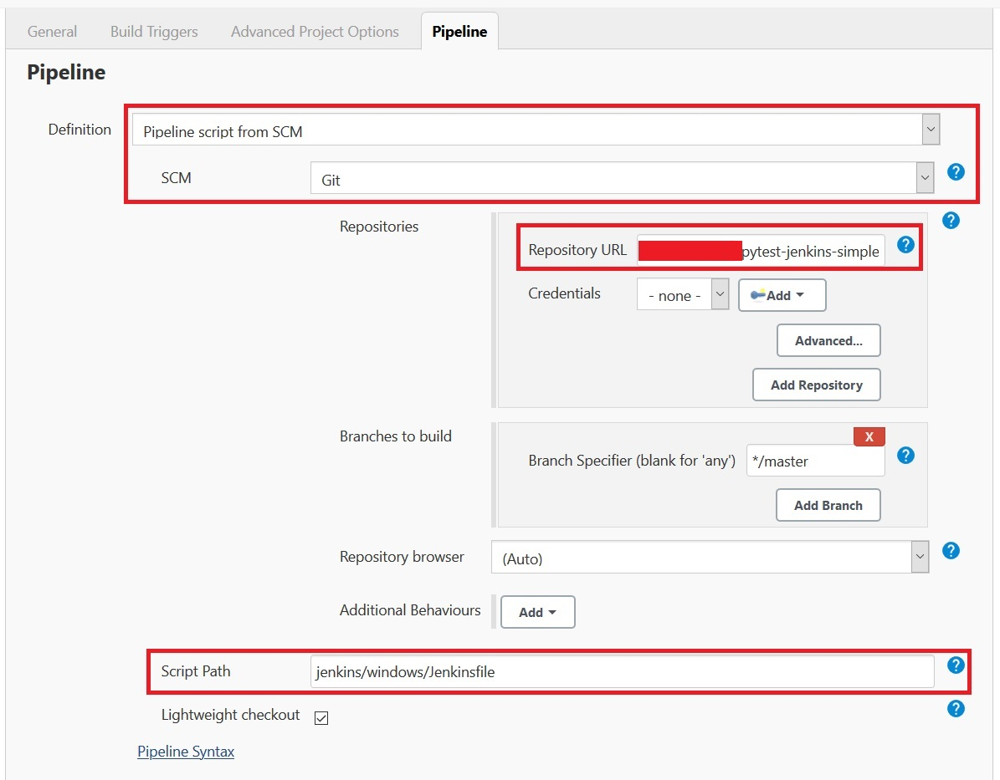

# pytest-jenkins-simple

Simple PyTest repo to run Jenkins on. This repo will use `pipenv` for its virtual environment.

# Running Jenkins WAR file in Windows

- Download and install either `Java 8` or `Java 11`
- Download and install the latest version of [Git](https://git-scm.com/downloads)
- Download the latest version of [Jenkins](https://www.jenkins.io/download/)
- Open a command prompt / terminal and run the following commands, replacing `<C:\some-java-path\bin>` with the full path to java `bin` directory (make sure to also remove the brackets!) and `<C:\some-git-path\bin>` with the path to the git `bin` directory.
  - If need to, please change the `--httpPort` to another port number, such as `8383`. `8080` is the default port that Jenkins will use.

```
set PATH=<C:\some-java-path\bin>;<C:\some-git-path\bin>
java -jar jenkins.war --httpPort=8080
```

- Open a browser and go to `localhost:8080`. Change `8080` to the port that you used in the previous step.
- Follow the instructions on the site. Install any suggested plugins, set up an admin user, and you're good to go!

# Setting up a pipeline in Windows

- In `jenkins\windows\Jenkinsfile`, in the `environment` section, make sure the path of your `python.exe` is included in the `PATH` variable. The paths in `PATH` variable are separated by a semi-colon `;`
- Back on the Jenkins website, click on **New Item** -> **Pipeline**. Name the project anything you want.
- After that, we will be in the Pipeline settings. Click on the **Pipeline** tab (or just scroll down), and emulate this image. 
  - Make sure that in the **Repository URL** field, use the full local path to the **root** directory of your Git repository, e.g. if this repository is the one you want to set up for, supply the full path such as `full-path/pytest-jenkins-simple`
  - In the **Script Path**, supply the `Jenkinsfile` location
- Click on **Apply** and **Okay**. You're all set!
